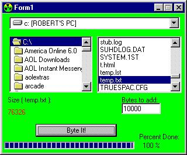



## Add junk data to your files, and they still work\!

### Description

This program adds meanless bytes to a file and therefore increases it's size. The files will still work correctly after this. I was bored when I made this, and is not hard at all.
 
### More Info
 

             |
---                |---
**Submitted On**   |2002-11-02 20:14:50
**By**             |[Robert Altman](https://github.com/Planet-Source-Code/PSCIndex/blob/master/ByAuthor/robert-altman.md)
**Level**          |Beginner
**User Rating**    |4.2 (21 globes from 5 users)
**Compatibility**  |VB 5\.0
**Category**       |[Files/ File Controls/ Input/ Output](https://github.com/Planet-Source-Code/PSCIndex/blob/master/ByCategory/files-file-controls-input-output__1-3.md)
**World**          |[Visual Basic](https://github.com/Planet-Source-Code/PSCIndex/blob/master/ByWorld/visual-basic.md)
**Archive File**   |[Add\_junk\_d1491381132002\.zip](https://github.com/Planet-Source-Code/robert-altman-add-junk-data-to-your-files-and-they-still-work__1-40379/archive/master.zip)

